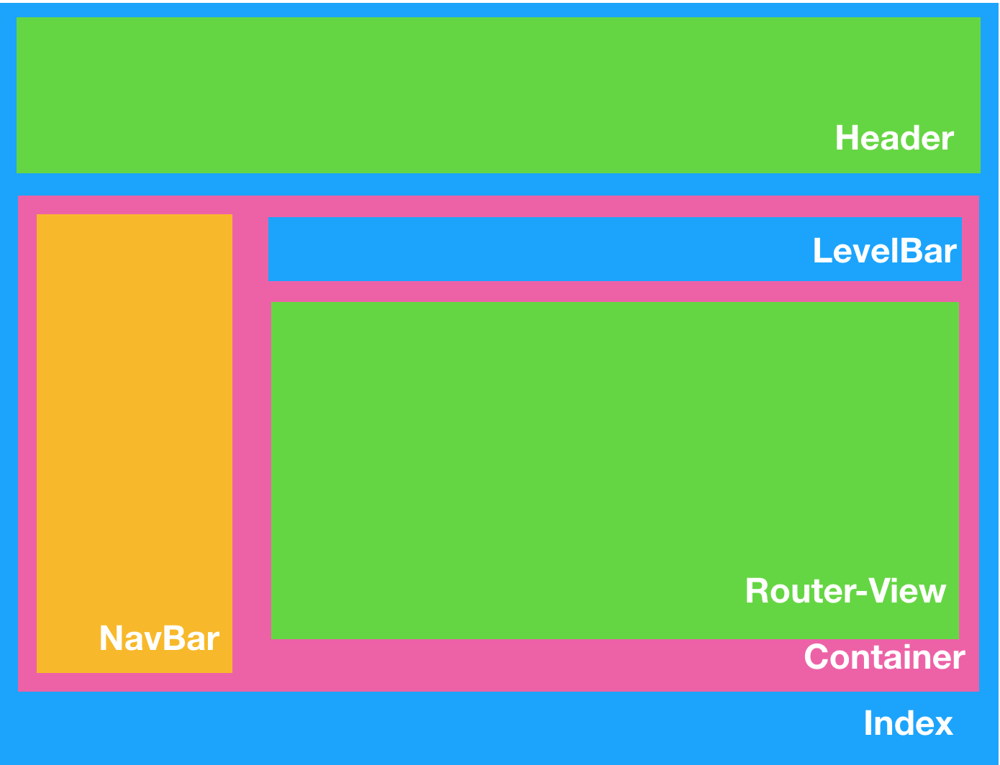
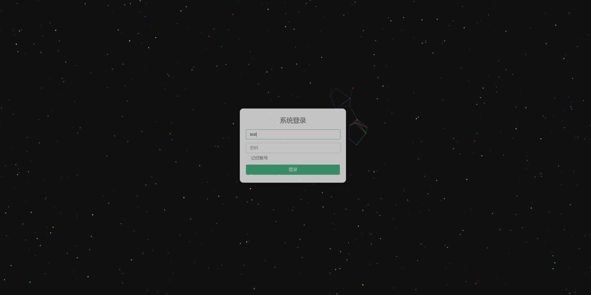

# N3-admin

vue / vuex / vue-router / N3 /axios

简述
---

本项目基于N3-components提供基本组件，是入门vue全家桶较全面的demo，同时也是一套可扩展的Admin模板。N3-admin适用于单页应用的快速上手，并不仅限于N3-components的使用，而是提供一个**比较完善的项目构建的思路和结构**，提供给初学者学习。

特性
---

+ [x] 项目工程相关
  * [x] 开发环境；静态文件服务器、HTTP代理、热更新
  * [x] 生产构建：代码编译提取压缩合并混淆hash命名base64~
  * [x] eslint
  * [x] babel
  * [x] webpack 2.x
+ [x] vue
  * [x] 组件分级 [路由级组件、复用型组件、基础组件(N3)]
  * [x] Vue扩展 [filters、directives等]
+ vue-router
  * [x] 二级路由
  * [x] 转场动画
  * [x] 路由拦截器
+ vuex
  * [x] 多模块(module)支持
+ [x] axios
  * [x] 支持多实例
  * [x] 请求、响应拦截器
  * [x] Vue 扩展，通过实例的方法可访问
+ [x] layout 布局
+ [x] 全局进度条 Nprogress
+ [x] css 预处理
  * [x] less
  * [x] postcss
  * [] stylus         <=  仅需安装预处理器和loader
  * [] sass / scss    <=  仅需安装预处理器和loader
+ [x] API 调用支持
  * [x] 接口配置
  * [] mock

布局
---

> 二级路由下生效



文件结构
---

```
.
├── README.md                           <=  项目介绍
├── build                               <=  工程构建相关 <Vue-cli>
│   ├── build.js                        <=  构建脚本
│   ├── check-versions.js               <=  Node Npm版本检查
│   ├── dev-client.js                   <=  开发客户端：浏览器刷新
│   ├── dev-server.js                   <=  开发服务器：静态文件服务器、代理、热更新
│   ├── utils.js                        <=  utils
│   ├── webpack.base.conf.js            <=  webpack基础配置
│   ├── webpack.dev.conf.js             <=  webpack开发配置
│   └── webpack.prod.conf.js            <=  webpack生产配置
├── config                              <=  工程构建配置：开发服务器端口、代理，静态资源打包位置等
│   ├── dev.env.js                      <=  开发环境配置
│   ├── index.js                        <=  入口
│   ├── prod.env.js                     <=  生产环境配置
│   └── test.env.js                     <=  测试环境配置
├── index.html                          <=  单页应用入口
├── package-lock.json                   <=  Npm Package 版本锁
├── package.json                        <=  Npm Package 配置
├── src                                 <=  项目源代码
│   ├── App.vue                         <=  Vue 根组件
│   ├── api.js                          <=  api 配置
│   ├── assets                          <=  静态资源
│   │   ├── font
│   │   │   ├── iconfont.eot
│   │   │   ├── iconfont.svg
│   │   │   ├── iconfont.ttf
│   │   │   └── iconfont.woff
│   │   ├── images
│   │   │   └── logo.png
│   │   ├── logo.png
│   │   └── styles
│   │       └── base.css
│   ├── config.js                       <=  项目配置
│   ├── extend                          <=  Vue 扩展相关
│   │   ├── filters.js                  <=  全局过滤器
│   │   ├── directive.js                <=  全局指令
│   │   └── index.js                    <=  扩展入口
│   ├── layout                          <=  布局组件
│   │   ├── container.vue
│   │   ├── header.vue
│   │   ├── index.vue
│   │   ├── levelbar.vue
│   │   └── navbar.vue
│   ├── main.js                         <=  Vue 入口
│   ├── mock                            <=  Mock
│   ├── router                          <=  路由配置
│   │   ├── index.js
│   │   └── routes.js
│   ├── store                           <=  Vuex
│   │   ├── actions
│   │   │   └── user.js
│   │   ├── index.js
│   │   ├── modules
│   │   │   ├── app.js
│   │   │   └── user.js
│   │   └── mutation-types.js
│   ├── style                           <=  样式文件 
│   │   └── define.less
│   ├── utils                           <=  utils
│   │   ├── axios.js                    <=  axios
│   │   ├── const.js                    <=  常量
│   │   ├── index.js
│   │   └── storage.js                  <=  storage
│   └── widgets                         <=  可复用组件
│   └── views                           <=  路由级别的组件
│       ├── Login.vue
│       ├── form
│       │   └── index.vue
│       ├── table
│       │   └── index.vue
│       └── test
│           └── query.vue
├── static                              <=  服务器静态资源
│   └── favicon.ico
└── test                                <=  测试文件夹  
    └── unit
        ├── index.js
        ├── karma.conf.js
        └── specs
            └── Hello.spec.js
```

使用说明
---

+ 开发环境

```
npm run dev
```

+ 生产环境

```
npm run build
```

效果图
---

+ 总览


+ 登录



+ Table


+ Form


